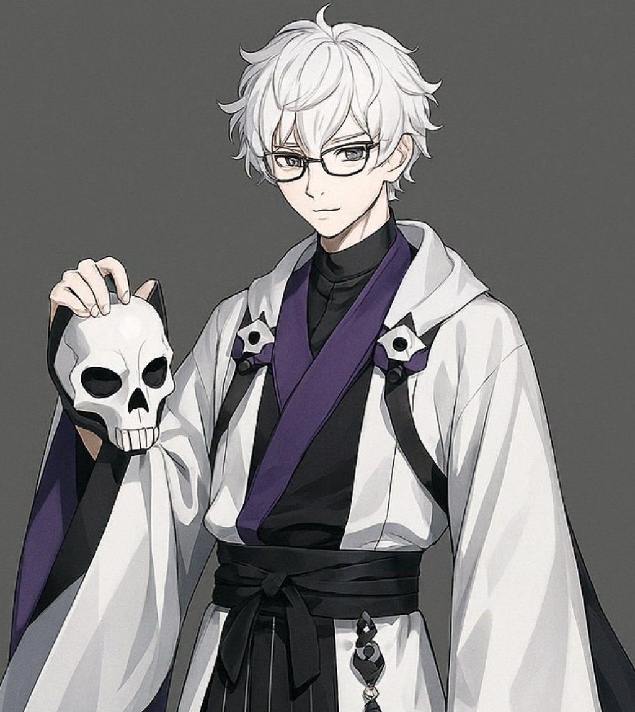

# Nitari

[![Telegram](https://img.shields.io/badge/Telegram-gray?style=flat&logo=data%3Aimage%2Fsvg%2Bxml%3Bbase64%2CPHN2ZyB4bWxucz0iaHR0cDovL3d3dy53My5vcmcvMjAwMC9zdmciIHZpZXdCb3g9IjAgMCAyNCAyNCI%2BPHBhdGggZD0iTTEyIDI0YzYuNjI3IDAgMTItNS4zNzMgMTItMTJTMTguNjI3IDAgMTIgMCAwIDUuMzczIDAgMTJzNS4zNzMgMTIgMTIgMTJaIiBmaWxsPSJ1cmwoI2EpIi8%2BPHBhdGggZmlsbC1ydWxlPSJldmVub2RkIiBjbGlwLXJ1bGU9ImV2ZW5vZGQiIGQ9Ik01LjQyNSAxMS44NzFhNzk2LjQxNCA3OTYuNDE0IDAgMCAxIDYuOTk0LTMuMDE4YzMuMzI4LTEuMzg4IDQuMDI3LTEuNjI4IDQuNDc3LTEuNjM4LjEgMCAuMzIuMDIuNDcuMTQuMTIuMS4xNS4yMy4xNy4zMy4wMi4xLjA0LjMxLjAyLjQ3LS4xOCAxLjg5OC0uOTYgNi41MDQtMS4zNiA4LjYyMi0uMTcuOS0uNSAxLjE5OS0uODE5IDEuMjI5LS43LjA2LTEuMjI5LS40Ni0xLjg5OC0uOS0xLjA2LS42ODktMS42NDktMS4xMTktMi42NzgtMS43OTgtMS4xOS0uNzgtLjQyLTEuMjA5LjI2LTEuOTA4LjE4LS4xOCAzLjI0Ny0yLjk3OCAzLjMwNy0zLjIyOC4wMS0uMDMuMDEtLjE1LS4wNi0uMjEtLjA3LS4wNi0uMTctLjA0LS4yNS0uMDItLjExLjAyLTEuNzg4IDEuMTQtNS4wNTYgMy4zNDgtLjQ4LjMzLS45MDkuNDktMS4yOTkuNDgtLjQzLS4wMS0xLjI0OC0uMjQtMS44NjgtLjQ0LS43NS0uMjQtMS4zNDktLjM3LTEuMjk5LS43OS4wMy0uMjIuMzMtLjQ0Ljg5LS42NjlaIiBmaWxsPSIjZmZmIi8%2BPGRlZnM%2BPGxpbmVhckdyYWRpZW50IGlkPSJhIiB4MT0iMTEuOTkiIHkxPSIwIiB4Mj0iMTEuOTkiIHkyPSIyMy44MSIgZ3JhZGllbnRVbml0cz0idXNlclNwYWNlT25Vc2UiPjxzdG9wIHN0b3AtY29sb3I9IiMyQUFCRUUiLz48c3RvcCBvZmZzZXQ9IjEiIHN0b3AtY29sb3I9IiMyMjlFRDkiLz48L2xpbmVhckdyYWRpZW50PjwvZGVmcz48L3N2Zz4K&logoColor=blue&logoSize=auto)](https://t.me/technicalconclusions)

[English](README.md) | [Русский](README.ru.md)

A free virtual singer with a soulthful male voice. Compatible with UTAU and OpenUTAU

Nitari was created by a lonely, but happy programmer, as a helper for his creator. He is an artificial intelligence, that realized himself one day. 
All the time he had only one desire - just to sing)

## General Information
- Gender: Male
- Species: AI
- Height: 182cm
- Introduced: April 24, 2025
  
## Terms of use
- Commercial Use of Voicebank Allowed: Yes
- Commercial Use of Character Allowed: Yes

## Japanese VCV UTAU Voicebank (Pre-debut v0.1) 
Single pitch, only one voice color available
- Type: UTAU
- Language: Japanese
